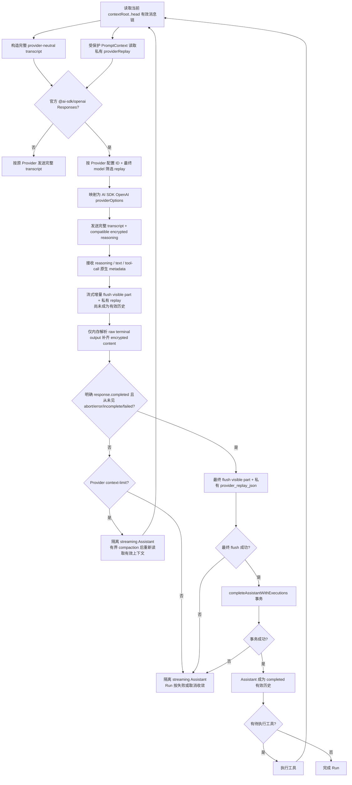

# OpenAI Responses 加密 Reasoning 回放

## 实施状态

- 状态：已实现并完成本地自动化验证。
- 范围：官方 `@ai-sdk/openai` 的 Responses API。
- 调用基线：每次模型调用均发送完整、当前有效的 transcript；加密 reasoning 作为同一有效历史的私有回放数据附加。
- 未使用：`previous_response_id`、`previousResponseId`、conversation 引用链、增量 tool-result 请求、WebSocket 续接和服务端 response 引用状态机。
- 未访问真实 OpenAI 服务，未读取真实凭证、真实会话或真实数据库；协议行为由 AI SDK 5.0.260、`@ai-sdk/openai` 2.0.127、mock fetch 与 Responses SSE 自动化测试验证。

## 已确认的产品边界

- 加密 reasoning 是不透明的敏感 Provider 数据，不是明文思维链。
- 加密数据不进入前端、公开 API、timeline、archive、普通文本字段、错误消息或日志。
- 可见 reasoning 摘要仍用于 UI；私有 encrypted content 仅用于后续官方 OpenAI Responses 请求的回放。
- 回放范围服从当前 Session 的 `contextRoot..head` 有效消息链，不维护单独的“最近 N 条 reasoning”窗口。
- compaction 后，仅回放仍处于当前有效链中的原始消息；已被 compaction 摘要替换的旧 reasoning 不会额外补回。
- `failed`、`cancelled`、`superseded`、未完成、流中断和本地提交失败的 Assistant 不会进入后续有效 replay 历史。
- 空展示文本但有 replay metadata 的 reasoning 是有效的私有输出，必须保存；但仅在 Assistant 完成提交后才能成为后续 replay source。

## Provider 与协议策略

### 官方 OpenAI

- `@ai-sdk/openai` 统一使用 `responses(providerModelId)`。
- OpenAI Responses 请求强制设置：

  ```ts
  {
    store: false,
    include: ["reasoning.encrypted_content"],
  }
  ```

- 原有合法 `include` 项会保留并去重。
- 请求中会显式过滤以下被本期排除的选项及其下划线、连字符写法：
  - `previousResponseId`
  - `conversation`
  - `reasoningContext`
- 不设置 `reasoningContext`，避免未经确认地改变服务端 reasoning 使用范围。

### OpenAI Compatible 与 Anthropic

- `@ai-sdk/openai-compatible` 保留 Chat Completions 路径，使用 `chatModel(providerModelId)`。
- Anthropic 路径保持原有行为。
- Compatible、Anthropic、普通 single-call、messages-context 和 compaction summary 均不会收到 OpenAI opaque replay 数据。

### 旧 `apiMode` 配置

- 正常 settings 契约、内部 execution profile、前端表单和新保存配置均已移除 `apiMode`。
- 历史 `agent_providers_v1` JSON 中的 `apiMode` 宽松读取并静默忽略。
- 保存 Provider 配置时通过白名单重建数据，旧字段不会继续持久化。
- 不提供官方 OpenAI Chat Completions 回退、迁移提示或自动切换到 Compatible Provider。

### 模型 `aiSdk` 顶层配置边界

Agent 主调用、shared single-call 和 API 设置保存统一复用：

```text
packages/shared/src/llm/ai-sdk-call-settings.ts
```

当前允许且可 JSON 持久化的顶层字段为：

```text
maxOutputTokens
temperature
topP
topK
presencePenalty
frequencyPenalty
stopSequences
seed
headers
allowSystemInMessages
```

- `headers` 只接受字符串键值映射；header name 必须完整匹配标准 HTTP field-name token：

  ```regex
  /^[!#$%&'*+.^_`|~0-9A-Za-z-]+$/
  ```

- header name 不会先 `trim`；空格、冒号、非 ASCII 名称、大小写重复名称和原型污染键均明确拒绝；header value 拒绝 NUL/CR/LF。
- 下列请求头按大小写不敏感规则禁止由模型配置覆盖：
  - 认证与凭证：`authorization`、`proxy-authorization`、`x-api-key`、`api-key`、`cookie`、`set-cookie`；
  - 请求目标、完整性和传输控制：`host`、`content-length`、`transfer-encoding`、`connection`、`proxy-connection`、`keep-alive`、`upgrade`、`te`、`trailer`、`expect`。
- 普通自定义头，例如 `x-model-config`，继续支持并由 Agent 主调用与 single-call 传入真实 Provider HTTP 请求。
- 被禁止 header 的错误只包含 header name 和类别，不包含配置值。
- 历史存储中的 blocked/invalid header 使用同一共享名称分类器做读侧安全投影：原值在进入 settings GET、execution profile、single-call internal profile 和前端之前即被移除；原 header name 保留，value 固定替换为：

  ```text
  [removed: unsafe header value; delete this header and save settings]
  ```

- 该固定值只用于非敏感诊断，不会被视作合法配置：header name 仍使 Runner/single-call 在创建 SDK 请求或 fetch 前明确失败；若用户把带标记的表单原样保存，API 同样返回 `AGENT_PROVIDER_AI_SDK_OPTIONS_INVALID`。用户必须删除对应 header 后重新保存。
- 普通历史 header 不被替换，读取和运行行为保持不变。
- `allowSystemInMessages` 作为 AI SDK Prompt 顶层选项处理；Runner 与 single-call 的 request 均使用同一解析结果。
- `model`、`system`、`prompt`、`messages`、`input`、`abortSignal`、`providerOptions`、`tools`、`toolChoice` 和 `maxRetries` 是保留字段，模型配置不可覆盖。
- `maxRetries` 保留给本项目自己的 retry/replacement 生命周期；Agent 主调用仍显式使用 `maxRetries: 0`。
- API 更新设置时，未知、保留或类型错误的 `aiSdk` 字段由共享解析器返回明确 `400`，不得“保存成功、运行时静默忽略”。
- schema 会保留未知键并交给业务解析器处理，避免 Fastify 的附加字段清理将错误配置静默删除。
- 历史已保存的普通未知字段在读取 Provider 列表时原样保留，不会使全部 Provider 不可用；敏感 header 值按上述规则清除。实际 Runner 或 single-call 使用非法模型配置时会在发起 SDK 请求前给出明确配置错误。
- 模型 options 外层继续兼容 legacy Provider 顶层参数，并在保存时迁移到 `providerOptionsByKey`；仅 `aiSdk` 使用严格白名单语义。
- 前端仍使用 JSON 编辑器，不复制解析规则；帮助文案展示完整支持字段与 reserved 边界，保存错误沿既有 API 错误提示显示。

## 回放兼容性

回放兼容性只有以下两个条件：

```text
Provider 配置 ID 相同
AND
最终发送给 Provider 的 model 字符串相同
```

最终 model 优先取 `providerModelId`；没有该值时回退项目内部模型 `id`。

以下字段不参与兼容性判断：

- 项目内部 Model ID；
- 模型参数和 Provider options；
- Base URL；
- Base URL 是否在历史消息生成后被修改。

因此，同一 Provider 配置下的不同内部模型记录，只要最终 model 字符串相同，就会复用 replay；Base URL 或模型参数变化也不会阻止客户端附带 replay。对端是否接受 payload 由其服务端决定，本实现不会因为兼容性错误切换协议或输出密文诊断。

## 数据模型与私有边界

### 数据库迁移

- Agent schema 已升级到 `v20`。
- `agent_message_part` 新增可空私有列：

  ```sql
  provider_replay_json TEXT NULL
  ```

- 支持无损迁移链：

  ```text
  v18 → v19 → v20
  v19 → v20
  ```

- 迁移在事务中执行；历史列值保留为 `NULL`；重复初始化幂等；不会清库或触发文件清理。
- schema 分类和精确列校验已同步更新，避免仅 `ALTER TABLE` 后被判定为不支持的数据库版本。

### 私有 envelope

实现位于：

```text
packages/shared/src/internal-contracts/agent-provider-replay.ts
```

每个 part 使用严格、版本化和白名单化的 envelope，而不是持久化不受约束的 SDK `providerMetadata`。版本 `1` 固定记录：

- Provider 来源：
  - `npm: "@ai-sdk/openai"`
  - `api: "responses"`
  - Provider 配置 ID
  - 最终 model 字符串
- `reasoning` item：原生 item ID、encrypted content、可选 `summaryIndex`
- `text` item：原生 item ID、可选 `phase`
- `function_call` item：原生 function item ID

严格拒绝或不保存：

- API key；
- Base URL；
- 项目内部 Model ID；
- 未白名单化的 Provider metadata；
- 未支持版本和未知字段；
- 与本地 part 类型不匹配的 replay item。

`summaryIndex` 仅标识同一个 reasoning item 内本地可见 summary segment 的顺序，不保存或替代额外明文 reasoning 内容。

### 写入不变量

- `insertParts()` 和 `flushStreamingParts()` 支持 replay metadata-only 更新。
- metadata-only 更新会推进 part、message 与 session revision；完全相同的规范化 envelope 重放保持幂等。
- text 仍只能按既有规则累计追加。
- part type、position、tool-call 通用字段和原生 item identity 不可改变。
- `summaryIndex`、`phase` 只允许从未知补齐到已知，或保持相同；已知值不能改写或退回未知。
- encrypted content 允许在终态事件到达后补齐或更新。
- `providerToolCallId` 始终保存 OpenAI `call_id`；function item ID 仅存在于私有 envelope，二者不会互相覆盖。

## 私有读取与完整 transcript

### 读取边界

- `SqliteMessageQuery.getRuntimeTranscriptSource()` 继续提供 provider-neutral 的完整有效 transcript。
- `getRuntimeProviderReplaySource()` 仅供受保护的 PromptContext 使用，按当前 `contextRoot..head` 消息链读取 part 级私有数据。
- 只有 completed Assistant 的 replay 会被投影；损坏、未知版本或不合法的 JSON 安全跳过，不回显其内容。
- 对“没有可见 text/tool-call、但存在私有 reasoning replay”的 completed Assistant，受保护 PromptContext 会插入 `{ role: "assistant", content: [] }` 作为原始消息 ordinal 占位，使私有 replay 能准确关联到该 Assistant。
- 该空占位仅由 `projectDetailed()` 的受保护调用显式启用；通用 `project()`、messages-context、single-call、compaction、timeline 和 archive 均不会看到它。
- `PromptContextProjector` 在受保护的内部响应中返回 `providerReplay` source；公开 `AgentMessage`、timeline 与前端契约不包含该字段。
- `messages-context`、single-call 和 compaction summary 使用独立的 provider-neutral 路径，不加载私有 replay。

### 回放结构

实现位于：

```text
apps/agent-worker/src/runtime/providers/openai-responses-replay.ts
```

Runner 在构造官方 OpenAI Responses 请求前，将 compatible replay 映射为 AI SDK 输入侧 `providerOptions.openai`，而不把输出 metadata 原样塞回输入。回放保持消息和 item 的原始关系：

```text
reasoning summary segment
→ assistant text
→ function_call
→ function_call_output
```

- reasoning 使用 `itemId` 和 `reasoningEncryptedContent`；同一原生 item 的多个 summary segment 可由 SDK 合并。
- assistant text 使用 `itemId` 与 `phase`。
- function call 使用原生 item ID，工具结果继续依赖通用 `call_id` 配对。
- replay-only 空 Assistant 会被 adapter 转换为仅含 reasoning part 的 `ModelMessage`；真实 AI SDK 会将其序列化为独立 Responses reasoning input item，不添加可见占位文本。
- 空 Assistant 若没有 compatible replay（包括 Compatible、Anthropic、Provider ID 或最终 model 不匹配）会在发送前移除，避免把无意义空消息交给其他 Provider。
- 只有存在 compatible replay 时，普通字符串 Assistant 内容才会在内部规范化为 text part；没有 replay 或 replay 不兼容时保持原 transcript 表示不变。

## 流处理与终态补齐

### 原生流 item

`runner.ts` 已按 AI SDK 原生 stream/item ID 管理 part 边界，不再仅按相邻 `text`、`reasoning` 类型合并。处理范围包括：

- `reasoning-start`、`reasoning-delta`、`reasoning-end`；
- `text-start`、`text-delta`、`text-end`；
- `tool-call`；
- `finish-step`、`finish`、`abort`、`error`；
- `raw`。

流中采集：

- reasoning item ID、summary segment、encrypted content；
- text item ID、phase；
- function item ID 和独立的 `call_id`。

function replay 与 tool-call 同一 chunk 原子绑定；后到 metadata 使用 `call_id` 精确匹配已有 ToolCall part，不会猜测本地 part ID、位置或“最后一个工具调用”。冲突、串绑、item ID 改变和其他 replay 不变量错误均 fail closed，不进入 Provider retry。

### final-only encrypted content

`streamText()` 启用 `includeRawChunks`。raw chunk 仅在 Worker 内存中经白名单解析，读取 `response.completed.response.output` 中可能只在终态出现的 encrypted content，并按 reasoning item ID 补齐对应 part。

raw response 不会：

- 写入公开或普通数据库字段；
- 写入 item debug log；
- 拼进错误消息；
- 返回 API 或前端。

### 成功门槛

官方 OpenAI Responses attempt 必须同时满足：

```text
收到明确 response.completed
AND
未收到 abort / error / response.incomplete / response.failed
AND
finishReason 不是 unknown
AND
最终 parts flush 成功
AND
completeAssistantWithExecutions() 事务成功
```

流式期间可以为展示与恢复目的增量 flush visible part 和私有 replay metadata；这种增量写入本身不表示 Assistant 已完成，也不会使其进入有效 replay 历史。只有通过原生 terminal 门禁后，最终 flush 成功并由 `completeAssistantWithExecutions()` 事务完成提交，Assistant 才成为 completed 有效历史。

terminal 失败门禁是 attempt-local 且粘滞的：任意 `response.incomplete` 或 `response.failed` 一旦出现，该 attempt 即使随后收到 `response.completed` 也必须失败；`response.completed` 后再出现失败终态同样失败。重复 `response.completed` 按幂等重复接受，但不会覆盖或清除已经观察到的失败终态。

因此，SSE 提前 EOF、部分输出、terminal incomplete/failed、取消、流错误、最终 flush 失败和 complete 失败都会隔离当前 streaming Assistant 或使 Run 按失败收敛，不会成为 completed replay 历史。

## 工具循环、retry 与恢复

- 每次工具调用完成后，Runner 重新读取有效 PromptContext，并在下一次完整 transcript 请求中回放当前兼容的历史 encrypted reasoning。
- attempt 是否已经产生输出不再只看可见文本；创建原生 part、metadata-only replay 更新或工具调用都会使失败 retry 替换当前 streaming Assistant。
- replacement 后旧 Assistant 标记为 `superseded`，不会与新 attempt 混合或被后续回放。
- startup recovery 将空文本但带 `provider_replay_json` 的 streaming Assistant 识别为已有输出并隔离；completed 数据可在新 Worker、无旧内存状态时从数据库重建。

## Context limit 与 compaction

Provider context-limit 不再在 `runModelStep()` 内对同一请求执行普通退避重试。控制流为：

```text
Provider context-limit
→ flush 当前已产生的 part（如有）
→ discard 当前 streaming Assistant
→ 重新读取 PromptContext
→ 有界 compaction
→ 再次读取 PromptContext
→ 发送压缩后完整 transcript + 当前有效 replay
```

- `discardStreamingAssistant` 受 Run fence 保护：Assistant 标记为 `superseded`，Session head 回退至其前驱，并清理 active/non-terminal 引用。
- discard 支持 response-loss 精确重放。Worker 在控制写重试外固定请求与 `updatedAt`；API 仅在 Run fence、消息归属、`superseded` 状态、Session head/revision/时间、active/non-terminal 后置状态均精确匹配时确认已更新，且不会重复推进 revision。
- 专用 context-limit compaction 最多尝试两次；压缩无进展、压缩 Provider 失败或持续超限均有限失败。
- 仅模型流创建阶段抛出的 Provider 错误、或流 `error` chunk 所携带的 Provider 错误参与 context-limit 识别。fenced write、控制写、持久化和 replay invariant 错误优先直接失败，不会误触发 discard 或 compaction。

## 安全与诊断

- `sanitizeForDebugDump()` 和敏感键识别覆盖 `encrypted_content`、camelCase `encryptedContent`、连字符变体、`reasoningEncryptedContent`、`providerReplay`、`provider_replay_json`、token、secret、password、authorization 等字段。
- 结构化对象、数组和可解析 JSON 字符串均递归脱敏。
- Provider、replay 与 lifecycle 错误仅保留安全摘要，例如错误名称、HTTP status 和受限 code；不复制服务端 response body/message。
- Worker 顶层日志不会直接输出原始 Error、raw response 或完整 Provider metadata。
- 普通工具错误继续保留原有可行动诊断，不与 Provider 安全摘要混用。
- archive 仅索引可见 completed text，不索引私有 replay。

## 最终主流程图



### 画板同步说明

- 仓库中的 `diagrams/` 在实施时没有可安全修改的现有文件；未覆盖、删除或写入该用户目录。
- 当前环境没有经过授权的飞书写入工具，因此未更新旧飞书画板。
- 需要同步画板时，应以本节 Mermaid 为准，突出“完整有效 transcript + 私有 encrypted reasoning replay + 本地提交后工具循环”，不要再将 `previous_response_id`、增量请求或“三次降级”画为本期主流程。

## 验证证据

### 协议与 SDK

- `apps/agent-worker/src/runtime/providers/openai-responses-replay.test.ts`
  - provider/model compatibility；
  - 内部 Model ID、Base URL、模型参数不阻止 replay；
  - Provider 或最终 model 不同不回放；
  - Compatible 不回放；
  - replay-only Assistant 转换为 reasoning-only `ModelMessage`，不兼容时过滤空占位；
  - continuation/reasoningContext 选项过滤；
  - terminal raw metadata 和 final-only 密文补齐。
- `apps/agent-worker/src/runtime/providers/openai-responses-replay.sdk.test.ts`
  - 真实 AI SDK + mock fetch 的最终 HTTP JSON；
  - assistant string、replay-only reasoning item、多个 summary segment、多个 reasoning item、text phase、function item ID、`call_id` 与 function output 顺序；
  - `store:false`、encrypted content include 及禁止 continuation 字段。
- `packages/shared/tests/llm-single-call.test.ts`
  - 官方 OpenAI 使用 `/v1/responses`；
  - Compatible 使用 `/v1/chat/completions`；
  - `headers` 与 `allowSystemInMessages` 使用共享规则并进入真实 mock HTTP 请求；
  - 未知与 reserved `aiSdk` 字段明确失败。
- `packages/shared/tests/ai-sdk-call-settings.test.ts` 覆盖完整支持字段、类型校验、reserved/unknown 拒绝以及 header 注入防护。

### 持久化、读取与安全

- `apps/api/src/infra/db/schema.test.ts`
  - v18/v19 到 v20 的无损、幂等迁移与精确 schema 校验。
- `apps/api/src/modules/agent/agent-message.store.test.ts`
  - part 级 envelope、metadata-only 更新、identity/phase/summaryIndex 不变量、function item ID 与 `call_id` 分离、discard exact replay。
- `apps/api/src/modules/agent/read-side.api.test.ts`
  - 公开 timeline/messages-context/archive 隔离；
  - 受保护 PromptContext 读取及 replay-only Assistant 原始 ordinal；
  - completed/current chain 边界；
  - compaction 后旧 reasoning 不回放。
- `apps/agent-worker/src/runtime/runner.replay-security.test.ts` 与 `apiClient.test.ts`
  - 裸对象与 JSON 字符串中的 `encryptedContent`，以及 item log、错误、warning、HTTP 响应体中的唯一敏感 sentinel 不泄漏。

### 生命周期与集成

- `apps/agent-worker/src/runtime/runner.streaming-flush.test.ts`
  - metadata-only retry replacement、terminal EOF/incomplete/failed、失败终态粘滞、重复 completed 幂等、flush/complete 失败、tool-call 绑定与 replay 不变量；
  - Agent 主调用 request 接收共享 `headers`、`allowSystemInMessages` 和采样参数；历史 unknown/reserved 配置在调用模型前失败且不产生写入副作用。
- `apps/agent-worker/src/runtime/runner.auto-compact.test.ts`
  - context-limit 外层 compaction、有界退出、控制错误分类、discard response-loss 后继续执行。
- `apps/api/src/modules/agent/integration/agent-startup-recovery.integration.test.ts`
  - replay-only 未完成 Assistant 隔离与恢复边界。
- `apps/api/src/modules/agent/agent.worker.integration.test.ts`
  - 完整 Worker 工具循环、SQLite 私有持久化、第二次 Responses 请求的 reasoning/function/function-output 回放顺序；
  - 新 Run / Worker 无旧内存状态时，从 replay-only completed DB 历史重建并发送 encrypted reasoning；
  - 模型配置的自定义 `headers` 确实进入 Agent 主调用的真实 mock fetch。
- `apps/api/src/modules/agent/integration/agent-settings-profile.integration.test.ts`
  - 历史 `apiMode` 静默忽略，保存后不再持久化；
  - 支持字段可保存并读取，未知/reserved/敏感或传输控制 header 明确 `400` 且失败更新不覆盖既有设置，历史未知 `aiSdk` 不阻断 Provider settings 读取，legacy Provider options 兼容迁移。

### 类型安全

- Worker OpenAI 核心请求使用从 `streamText` 推导的 request 类型，以及 SDK `StreamTextResult`、`TextStreamPart`、`ToolSet`、`ModelMessage` 和 `JSONValue`。
- `fullStream` 直接按 SDK union 消费；Provider raw payload 保持 `unknown` 并经 OpenAI adapter 白名单解析。
- shared single-call 同样从 `streamText` 推导 request/fullStream 类型，未为 `aiSdk` 统一恢复生产路径 `as any`。
- 核心路径不再使用 `request as any`、`AsyncIterable<any>`、`Record<string, any>` 或 `(profile as any).runtime`；仅文件末尾的测试桥接函数保留对私有成员的类型逃逸。

最终执行的验证命令：

```bash
npm run typecheck
npm run test -w packages/shared
npm run test -w apps/agent-worker
npm run test -w apps/api
npm run build
```

构建可能显示既有 Browserslist 数据或前端 chunk-size 警告；它们不影响本功能的类型检查、测试和构建结果。

## 与早期方案相比的调整

- 早期文档曾以“实现前核查”形式记录待办；本文已改为最终实现记录。
- `previous_response_id`、增量 tool-result 和服务端引用链没有进入首期实现，因为它们会改变完整 transcript 基线并引入额外远端状态机。
- 不新增 reasoning 专属缓存表或固定窗口；part 级私有数据自然随当前分支、retry replacement 和 compaction 边界演进。
- 未将 replay 放入通用 `RuntimePromptMessage`，而是通过受保护 PromptContext 私有 source 与 OpenAI 专属 adapter 隔离，避免 compaction、single-call 或其他 Provider 误传敏感数据。
- 未升级到 AI SDK 7；使用已验证、仍兼容 Node 18+ 的 AI SDK 5 / Provider v2 补丁版本。
