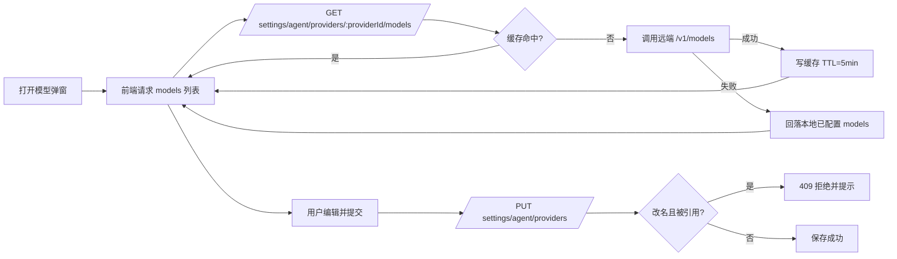

# Provider 设置页模型弹窗：modelId 可输入下拉 + 远端模型列表 + 引用保护改名策略（v1）

本文档描述 Settings → Agent → Providers 中“设置模型”弹窗的改造方案：

- `modelId` 从只读输入框改为**可输入下拉**；
- 弹窗打开即请求 Provider 远端模型列表（仅 OpenAI + Anthropic）；
- 模型列表查询结果采用 **TTL=5 分钟**缓存；
- 编辑时允许修改 `modelId`，但若旧 `modelId` 被引用则**禁止改名（方案 B）**。

---

## 背景

当前 Provider 面板中，模型编辑弹窗的 `modelId` 字段不可编辑；用户在录入模型时需要手填，缺少候选项，且无法在编辑时修正命名。

同时，现有保存机制是“操作后即持久化”：用户执行新增/编辑/删除模型等动作后，前端会直接调用 `updateAgentProvidersSettings` 提交到后端（无独立“保存”按钮、无输入级自动 watch+debounce 保存）。

随着 Provider 自定义 `baseURL`、模型数量增长，用户希望弹窗内能快速选择常见模型并保留手动输入兜底。

---

## 目标

1. 提升模型录入效率：`modelId` 支持“可选 + 可输”。
2. 弹窗打开即拉取远端模型候选（best-effort）。
3. 支持 OpenAI 与 Anthropic 两类 Provider。
4. 通过后端缓存（TTL=5min）降低重复请求。
5. 编辑时允许改 `modelId`，但若旧值被引用，阻止改名并提示用户。
6. 保持现有 Provider 面板“操作后 `persist` 保存”的整体交互逻辑不变。

## 非目标

1. 不扩展到 OpenAI/Anthropic 之外的 Provider。
2. 不在本期做模型能力探测（如 context window 自动回填、能力标签标准化）。
3. 不做跨页面复杂联动编辑（例如自动批量重写 Agent 配置中的引用）。
4. 不修改 Git 历史或引入新的存储引擎。

---

## 术语

- **Provider 远端模型列表**：通过 provider 的 `baseURL + apiKey` 调用其 `/v1/models`（或兼容路径）得到的候选模型。
- **本地配置模型**：`settings/agent/providers` 中 `providers[].models[]` 已保存的模型项。
- **被引用**：某模型被以下任一配置引用：
  - 全局默认模型 `providers.default`；
  - 任一 Agent 的 `agents[].defaultModel`。
- **改名**：编辑模型时 `modelId` 从旧值 `oldId` 变更为新值 `newId`（`oldId !== newId`）。

---

## 现状与证据

### 1) `modelId` 当前不可编辑

- `apps/web/src/features/settings/components/AgentProvidersSettingsPanel.vue:223-225`
  - 当前为 `<a-input v-model:value="modelFormId" disabled />`。

### 2) Provider 面板当前为“操作后即持久化”

- `apps/web/src/features/settings/components/AgentProvidersSettingsPanel.vue:912-933`
  - `persist()` 内调用 `updateAgentProvidersSettings(body)`；
  - 保存失败保留本地改动，后续操作再次触发保存。
- 同文件多个操作后触发 `persist`（如 `submitModel` 等）。

### 3) 引用点存在且运行时强依赖 `providerId + modelId`

- 全局默认模型定义：
  - `packages/shared/src/contracts/settings.ts:78-86`（`AgentProvidersDefaultSchema`）
- Agent 默认模型定义：
  - `packages/shared/src/contracts/settings.ts:222-223,257`（`AgentDefaultModelSchema` / `AgentItem.defaultModel`）
- 运行时解析模型：
  - `apps/api/src/modules/settings/settings.service.ts:1505-1524`
  - 若找不到模型会抛 `AGENT_MODEL_NOT_FOUND`。

### 4) Providers 更新时模型 ID 要求唯一

- `apps/api/src/modules/settings/settings.service.ts:1305-1309`
  - `AGENT_PROVIDER_MODEL_DUPLICATE`。

### 5) 相关现有接口

- Providers 设置：
  - `GET /api/settings/agent/providers`
  - `PUT /api/settings/agent/providers`
  - 路由：`apps/api/src/modules/settings/settings.routes.ts:159-180`
- Agent 设置：
  - `GET/PUT /api/settings/agent/agents`
  - 路由：`apps/api/src/modules/settings/settings.routes.ts:251-295`

---

## 关键决策：为什么选择“被引用则禁止改名（B）”

选择 B 的原因：

1. **避免隐式批量改写**：自动迁移 `agents[].defaultModel` 容易造成“看不见的副作用”。
2. **降低一致性风险**：多配置联动改写需要更强原子性保障，本期可先用“禁止改名”保障稳定性。
3. **与现有保存模式一致**：保持当前“局部编辑、立即保存”的心智，不引入跨模块事务。
4. **错误可解释**：明确提示“被哪些配置引用，需先解除引用再改名”。

---

## 总体方案



---

## 后端设计

## 1) 新增统一模型列表接口

### 路由（建议）

`GET /api/settings/agent/providers/:providerId/models`

### 鉴权

沿用现有 `/api/*` 鉴权钩子（cookie session）：
- `apps/api/src/app/auth.ts:18-31`

### 请求参数

| 参数 | 位置 | 必填 | 说明 |
|---|---|---:|---|
| `providerId` | path | 是 | Provider 唯一 ID |
| `refresh` | query | 否 | `1/true` 时绕过缓存强制拉远端 |

### 响应示例（成功）

```json
{
  "providerId": "openai-main",
  "items": [
    { "id": "gpt-4.1-mini", "label": "gpt-4.1-mini" },
    { "id": "gpt-4.1", "label": "gpt-4.1" }
  ],
  "source": "remote",
  "cached": false,
  "fetchedAt": 1770000000000,
  "expiresAt": 1770000300000,
  "warning": null
}
```

### 响应示例（远端失败降级）

```json
{
  "providerId": "anthropic-main",
  "items": [
    { "id": "claude-sonnet-4-5", "label": "claude-sonnet-4-5" }
  ],
  "source": "fallback",
  "cached": false,
  "fetchedAt": 1770000000000,
  "expiresAt": 1770000300000,
  "warning": "Remote models API unavailable, fallback to configured models"
}
```

## 2) Provider 支持范围

仅支持：
- `@ai-sdk/openai`
- `@ai-sdk/anthropic`

其余 provider 返回 400：
- `AGENT_PROVIDER_MODELS_UNSUPPORTED_PROVIDER`

## 3) 远端请求策略（best-effort）

1. 从 `settings/agent/providers` 读取 provider 的 `baseURL/apiKey/npm`。
2. 构造请求地址：`{baseURL}/v1/models`（需处理 baseURL 尾斜杠/已含 `/v1` 的兼容拼接）。
3. 请求超时：建议 5 秒。
4. 失败不阻塞 UI：回落到本地配置模型 `providers[].models[].id`。

## 4) 缓存策略（TTL=5min）

- TTL：`300_000 ms`。
- 缓存 key：建议包含 `providerId + npm + baseURL + apiKey指纹`。
  - `apiKey` 不存明文，仅使用稳定指纹（如 hash 截断）。
- 命中返回 `source=cache`。

### 缓存失效

1. TTL 到期自动失效。
2. `PUT /api/settings/agent/providers` 成功后：
   - 清理受影响 provider 的 models 缓存；
   - 若难以精确识别，允许先清理全部 provider models 缓存（实现更稳）。
3. `refresh=true` 强制绕过缓存并刷新。

## 5) 错误码建议

| HTTP | code | 场景 |
|---:|---|---|
| 400 | `AGENT_PROVIDER_NOT_FOUND` | providerId 不存在 |
| 400 | `AGENT_PROVIDER_MODELS_UNSUPPORTED_PROVIDER` | 非 OpenAI/Anthropic |
| 400 | `AGENT_PROVIDER_API_KEY_MISSING` | 缺少 apiKey |
| 504 | `AGENT_PROVIDER_MODELS_TIMEOUT` | 远端列表请求超时（若选择硬失败模式） |
| 502 | `AGENT_PROVIDER_MODELS_REMOTE_ERROR` | 远端返回异常（若选择硬失败模式） |
| 409 | `AGENT_PROVIDER_MODEL_RENAME_REFERENCED` | 提交 providers 更新时，改名命中引用保护 |

> 说明：对“列表接口”推荐默认不抛 5xx 给前端，而是返回 `source=fallback` + `warning`；上表 504/502 可用于日志和可观测性或调试开关场景。

## 6) 引用保护（B）后端兜底

在 `updateAgentProvidersSettings` 流程增加“改名保护校验”：

1. 与当前已存 providers 对比，识别每个 provider 下 `oldId -> newId` 改名（更精确地说：旧集合中删除且新集合新增）。
2. 若检测到改名，查询引用：
   - `providers.default` 是否指向 `{providerId, oldId}`；
   - `settings/agent` 中任一 `agents[].defaultModel` 是否指向 `{providerId, oldId}`。
3. 若存在引用，拒绝本次更新（409 `AGENT_PROVIDER_MODEL_RENAME_REFERENCED`），并返回 `details`（引用来源摘要）。

这样可避免仅靠前端检测带来的并发竞态。

---

## 前端设计

## 1) 交互改造范围

文件：
- `apps/web/src/features/settings/components/AgentProvidersSettingsPanel.vue`
- `apps/web/src/shared/api/api.ts`（新增 models list API 封装）

## 2) modelId 字段改为“可输入下拉”

现状字段：`modelFormId` 为 disabled input。改造后：

- 使用 `a-select`（可搜索）承载候选；
- 允许用户输入非候选值（自由输入）；
- 保持 `v-model` 绑定到 `modelFormId`。

候选项来源：`GET /api/settings/agent/providers/:providerId/models` 返回的 `items[]`。

## 3) 弹窗打开即请求

在以下入口触发请求（不改变现有保存机制）：
- `openAddModel(providerId)`
- `openEditModel(providerId, modelId)`

请求状态：
- `modelsLoading`：下拉显示 loading；
- `modelsError`：失败时提示“远端列表获取失败，已回落本地候选/可手动输入”；
- `modelOptions`：按接口结果填充。

## 4) 编辑时可改 modelId + 引用保护

### 前端预检查（轻量）

提交前可用现有 `GET /api/settings/agent/agents` 做一次轻量检查：
- 若 `mode=edit` 且 `modelFormOriginalId !== modelFormId`，检查是否有 `agents[].defaultModel` 引用旧值；
- 也检查当前 `selectedDefault`（全局默认）是否引用旧值。

若命中引用：
- 阻止提交；
- 错误提示示例：
  - `模型 ID 正被引用（全局默认/Agent: xxx），请先解除引用后再修改。`

### 后端兜底

即使前端预检查通过，仍以后端 409 作为最终一致性保障。

## 5) 重名校验（同 provider 内唯一）

- 创建模式：保持现有唯一性检查。
- 编辑模式：新增“排除自身后查重”。
  - 若改成同 provider 下其他模型已存在的 ID，禁止提交并提示。

## 6) 保持现有 persist 逻辑

- 仍在用户点击弹窗 OK 后走 `submitModel -> persist`；
- 不改为输入中自动保存；
- 与当前 `pendingSave` 合并保存策略保持一致。

---

## 兼容性与降级策略

1. 自定义 `baseURL` 或兼容网关可能不支持 `/models`。
2. 远端报错/超时时使用本地配置模型回退（best-effort）。
3. 允许手动输入 `modelId`，避免依赖远端列表导致流程阻塞。

---

## 安全设计

1. **不向前端暴露 apiKey**：远端列表请求仅后端发起。
2. 日志脱敏：
   - 不记录明文 `apiKey`；
   - 不记录完整 Authorization 头；
   - 错误日志可记录 providerId、状态码、耗时与错误码。
3. 缓存中不落明文密钥（仅指纹参与 key）。

---

## 实施步骤建议（不含代码）

1. 增加后端 models list 路由与 schema。
2. 实现 OpenAI/Anthropic 远端调用 + fallback + TTL 缓存。
3. 在 `updateAgentProvidersSettings` 增加“被引用禁止改名”校验（409）。
4. 前端新增 API client 方法并接入弹窗打开请求。
5. 将 `modelId` 字段替换为可输入下拉，补齐编辑态重名校验与引用提示。

---

## 测试与验证建议

## A. 手工测试用例

1. **新增模型（OpenAI）**
   - 打开弹窗立即出现 loading；
   - 候选列表出现；
   - 选择候选并保存成功。
2. **新增模型（Anthropic）**
   - 同上。
3. **远端列表失败回退**
   - 模拟 `/models` 404/超时；
   - UI 提示降级；
   - 仍可手动输入并成功保存。
4. **缓存命中**
   - 5 分钟内重复打开弹窗应优先走缓存；
   - 超过 5 分钟应重新拉取远端。
5. **缓存失效（配置变更）**
   - 修改 provider `baseURL` 或 `apiKey` 后再次打开弹窗，确保不使用旧列表。
6. **编辑改名-未被引用**
   - oldId -> newId，提交成功。
7. **编辑改名-被全局默认引用**
   - 提交被阻止并提示。
8. **编辑改名-被 agent.defaultModel 引用**
   - 提交被阻止并提示（前端或后端 409）。
9. **编辑改名-重名冲突**
   - 改为同 provider 现有 id，禁止提交。
10. **并发竞态**
    - 前端预检通过后，另一路新增引用；提交应被后端 409 拒绝。

## B. 关键单测点

1. 后端 models list：
   - OpenAI/Anthropic 正常解析；
   - 非支持 provider 返回 400；
   - 超时/异常 fallback 行为；
   - 缓存 TTL、生效与失效。
2. 后端 update providers：
   - 改名且未被引用 -> 通过；
   - 改名且被 `providers.default` 引用 -> 409；
   - 改名且被 `agents[].defaultModel` 引用 -> 409；
   - 同 provider 重复 modelId -> 400（既有）。
3. 前端弹窗：
   - 打开即请求；
   - loading/error/fallback 提示；
   - 可手动输入；
   - 编辑改名时重名校验与引用拦截。

---

## 风险与取舍

1. **B 方案限制了“快速改名”**：用户需先解除引用再改名，流程更稳但步骤更多。
2. **兼容网关差异**：`/models` 不保证稳定可用，因此必须保留 fallback + 手输。
3. **缓存一致性**：TTL 较长（5 分钟）时，务必依赖“配置变更后清缓存”避免陈旧数据。

---

## 参考代码路径

- Provider 面板与保存逻辑：
  - `apps/web/src/features/settings/components/AgentProvidersSettingsPanel.vue`
- Agent Profiles 与 defaultModel：
  - `apps/web/src/features/settings/components/AgentProfilesSettingsPanel.vue`
- 前端 settings API 封装：
  - `apps/web/src/shared/api/api.ts`
- settings 路由：
  - `apps/api/src/modules/settings/settings.routes.ts`
- settings 服务（provider 更新、执行 profile 解析）：
  - `apps/api/src/modules/settings/settings.service.ts`
- 合同定义：
  - `packages/shared/src/contracts/settings.ts`
