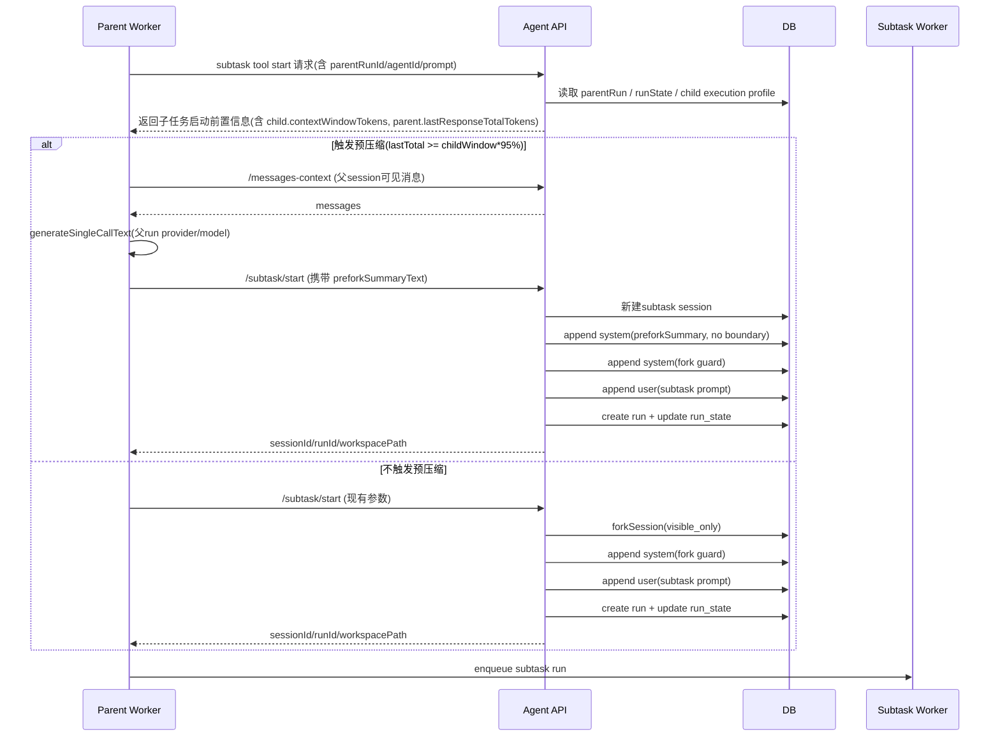

# subtask(mode=fork) 预压缩方案（使用父 run 模型）

> 基线版本：`v1.1.1`  
> 基线提交：`2436d95`  
> 文档目标：在不改动既有主流程语义的前提下，降低 `subtask(mode=fork)` 在“子任务模型上下文窗口更小”场景下的首轮失败概率。

---

## 目录（TOC）

1. [背景与问题](#背景与问题)
2. [目标 / 非目标](#目标--非目标)
3. [现状梳理（基于当前实现）](#现状梳理基于当前实现)
4. [方案概述](#方案概述)
5. [详细流程](#详细流程)
6. [接口与数据结构变更建议](#接口与数据结构变更建议)
7. [关键约束与取舍](#关键约束与取舍)
8. [风险与监控指标](#风险与监控指标)
9. [测试与回归清单](#测试与回归清单)
10. [迁移 / 灰度 / 回滚思路](#迁移--灰度--回滚思路)
11. [附录：关键代码位置](#附录关键代码位置)

---

## 背景与问题

在当前实现中，`subtask(session.mode="fork")` 会从父会话复制“可见上下文”到子会话，然后在子会话追加 fork guard + 子任务 prompt 并立即创建 run。

当子任务 agent 绑定的模型上下文窗口小于父会话此前使用模型时，可能出现以下问题：

- 子会话首轮请求就超上下文上限而失败；
- 由于失败发生在首次模型调用前后，既有自动压缩机制可能来不及生效；
- 子任务可用性受父会话上下文体积强烈影响。

本方案引入“fork 前预压缩（prefork compaction）”：在满足阈值条件时，不复制长上下文，而是先用父 run 模型生成针对子任务的摘要，再以“摘要 + guard + 子任务 prompt”启动子会话。

---

## 目标 / 非目标

## 目标

1. 在 `subtask(mode=fork)` 场景下，新增预压缩分支，降低子会话首轮超限失败概率。
2. 预压缩触发判据固定为：
   - `parent.lastResponseTotalTokens >= child.contextWindowTokens * 95%`
3. 预压缩输入范围固定为：
   - 父 session 可见消息（与现有 `messages-context` 视图一致）。
4. 预压缩摘要模型固定为：
   - 父会话 `parentRun` 的 `provider/model`（非子任务模型）。
5. 触发预压缩时，子会话上下文写入顺序固定为：
   - `预压缩摘要(system, 不标 boundary) -> fork guard(system) -> subtask prompt(user)`。

## 非目标

1. 不改动现有“常规自动压缩”主逻辑（`shouldAutoCompact + compactContext`）。
2. 不新增失败兜底重试（允许 subtask 失败）。
3. 不引入 boundary 标记用于预压缩摘要（避免额外 UI 语义）。
4. 不改变 `subtask new / existing` 语义，仅针对 `subtask fork`。

---

## 现状梳理（基于当前实现）

### 1) subtask fork 创建链路

- 入口：`apps/api/src/modules/agent/agent.service.ts`
- 方法：`startSubtaskRunFromWorker(...)`
- 关键行为（当前）：
  - `session.mode === "fork"` 时，优先走 `forkSession(..., mode: "visible_only")`（若有边界）；
  - 在子会话中追加 fork guard system；
  - 追加子任务 `user prompt`；
  - 创建子任务 run。

### 2) 自动压缩链路

- 入口：`apps/agent-worker/src/runtime/runner.ts`
- 判据：`shouldAutoCompact(...)`
  - 使用 `lastResponseTotalTokens` 与 `contextWindowTokens * autoCompactThresholdPct` 比较。
- 执行：`compactContext(...)`
  - 调 `generateCompactionSummary(...)` 生成摘要；
  - 调 `/api/internal/agent/context/compact` 落库归档。

### 3) compaction 摘要生成方式（可复用）

- 位置：`runner.ts -> generateCompactionSummary(...)`
- 方式：
  - 通过 `messages-context` 获取消息视图；
  - 通过 `generateSingleCallText(...)` 生成摘要；
  - 明确约束：**compaction 是内部摘要任务，不继承执行态 system prompt，也不提供 tools**。

---

## 方案概述

本方案将 `subtask(mode=fork)` 分为两条路径：

### 路径 A：触发预压缩（新增）

触发条件：

- `parentRunState.lastResponseTotalTokens` 存在，且
- `parentRunState.lastResponseTotalTokens >= childModel.contextWindowTokens * 95%`

执行策略：

1. **不走** `forkSession` 长上下文复制；
2. 在父 worker 侧复用现有摘要调用链生成“面向子任务 prompt 的预压缩摘要”（模型使用父 run provider/model）；
3. API 侧新建 subtask session；
4. 依次写入：
   - 预压缩摘要（system item，**不标 boundary**）
   - fork guard（system item）
   - subtask prompt（user item）
5. 创建并启动子任务 run。

### 路径 B：不触发预压缩（保持现状）

当条件不满足时，保持当前行为：

- 继续 `forkSession(... visible_only)` 复制可见上下文；
- 然后 fork guard -> subtask prompt -> create run。

---

## 详细流程



### 伪流程（简化）

1. 父 worker 执行 `subtask` 工具时，拿到：
   - `parentLastResponseTotalTokens`
   - 子任务模型 `contextWindowTokens`
2. 计算阈值：`threshold = childWindow * 0.95`
3. 若 `parentLast >= threshold`：
   - 生成 `preforkSummaryText`（父模型，输入为父 session 可见消息 + 子任务 prompt 聚焦提示）
   - 调子任务启动接口并携带 `preforkSummaryText`
4. API 收到 `preforkSummaryText` 时走“新建 session + 三条消息注入”路径
5. 否则走原有 forkSession 路径。

---

## 接口与数据结构变更建议

> 仅设计建议，不在本文落代码。

## 方案一（推荐）：扩展现有 `/api/internal/agent/subtask/start`

### 请求体新增可选字段

```ts
preforkSummaryText?: string
preforkMeta?: {
  strategy: "parent_run_model"
  triggerThresholdPct: 95
  parentLastResponseTotalTokens: number
  childContextWindowTokens: number
}
```

### 语义

- 仅当 `session.mode === "fork"` 时允许传 `preforkSummaryText`；
- 有 `preforkSummaryText`：走“新建子 session + 注入摘要”路径；
- 无 `preforkSummaryText`：保持现有 forkSession 行为。

### 校验建议

- `preforkSummaryText` 去空后不能为空；
- 长度上限可配置（防止异常超长）；
- 仅内部接口可用（沿用 internal token 鉴权）。

## 方案二：新增 endpoint（备选）

- 新增 `/api/internal/agent/subtask/start-prefork-compact`
- 与现有 start 解耦，语义更直观，但接口面增加。

---

## 关键约束与取舍

1. **预压缩摘要放在父 worker 生成**
   - 复用已存在的摘要调用封装（`messages-context + generateSingleCallText`）；
   - 保持“模型调用在 worker”边界，避免 API 承担 LLM 调用治理。

2. **为何使用父 run 模型而不是子任务模型**
   - 目标是避免“子模型上下文不足导致摘要也失败”；
   - 父 run 模型已证明可承载当前父会话上下文。

3. **为何预压缩摘要不标 boundary**
   - 该摘要属于“fork 前上下文重组织”，不是常规 compaction 归档边界；
   - 不标 boundary 可避免引入额外 UI 语义与边界副作用。

4. **为何压缩时仍引入 subtask prompt，且压缩后仍写入 subtask prompt**
   - 引入 subtask prompt用于让摘要“任务聚焦”；
   - 仍写入 subtask prompt用于保持显式用户指令与可审计性。

5. **为何不做失败兜底重试**
   - 复杂度收益比不高；
   - 当前策略接受 subtask 失败，并通过后续迭代优化。

---

## 风险与监控指标

## 主要风险

1. 跨模型 token 口径差异导致阈值误判（已通过 95% 冗余部分缓解）。
2. 摘要质量波动（可能出现过短/过泛化）。
3. 预压缩额外时延导致 subtask 首次响应变慢。

## 监控指标建议

1. `subtask_fork_start_total`
2. `subtask_prefork_compaction_trigger_total`
3. `subtask_prefork_compaction_success_total`
4. `subtask_prefork_compaction_summary_empty_total`
5. `subtask_run_failed_total`（按失败类型分组，含上下文超限）
6. `subtask_first_turn_latency_ms`（P50/P90/P99）
7. `subtask_prefork_path_ratio`（触发占比）

---

## 测试与回归清单

## 单测建议

1. 判据测试：
   - `lastResponseTotalTokens` 为空 -> 不触发；
   - 边界值（刚好等于 95%）-> 触发；
   - 小于阈值 -> 不触发。
2. 参数校验：
   - `preforkSummaryText` 空字符串/超长输入处理。
3. 顺序测试：
   - 触发预压缩时消息写入顺序必须是 `summary -> guard -> prompt`。

## 集成测试建议

1. 触发预压缩路径：
   - 断言未调用/未走 `forkSession` 长上下文复制分支；
   - 新子会话仅包含预期三段前置上下文后再运行。
2. 不触发路径：
   - 行为与现有 fork 流程一致（回归）。
3. 结果可见性：
   - 前端消息列表可见预压缩摘要、guard、子任务 prompt。
4. 失败可接受性：
   - 预压缩失败或子任务失败时，不额外重试，状态机与错误返回符合预期。

---

## 迁移 / 灰度 / 回滚思路

## 迁移

- 数据库不需要 schema 迁移（若仅扩展内部接口参数）。

## 灰度

- 增加运行时开关：`enableSubtaskPreforkCompaction`（默认关闭）；
- 可按 workspace / agent / 百分比逐步打开。

## 回滚

- 关闭开关即可回退到原 fork 行为；
- 保留接口字段向后兼容（服务端可忽略 `preforkSummaryText`）。

---

## 附录：关键代码位置

- `apps/api/src/modules/agent/agent.service.ts`
  - `startSubtaskRunFromWorker(...)`（subtask fork 创建入口）
  - `forkSession(...)`（fork 复制可见上下文）
- `apps/agent-worker/src/runtime/runner.ts`
  - `shouldAutoCompact(...)`（自动压缩判据）
  - `generateCompactionSummary(...)`（messages-context + generateSingleCallText）
  - `compactContext(...)`（压缩落库调用）
- `apps/agent-worker/src/runtime/apiClient.ts`
  - `getMessagesContext(...)`
  - `compactContext(...)`

---

## 一致性说明（与本设计输入约束对齐）

本文严格采用以下约束：

1. 预压缩触发判据：`parentLastResponseTotalTokens` vs `childContextWindowTokens * 95%`。
2. 预压缩输入范围：父 session 可见消息（`messages-context` 视图）。
3. 预压缩模型：父 run 的 provider/model。
4. 触发后路径：新建 subtask session，不走长上下文 fork 复制。
5. 写入顺序：`summary(system,no boundary) -> fork guard(system) -> subtask prompt(user)`。
6. 不提供失败兜底重试；允许 subtask 失败。
